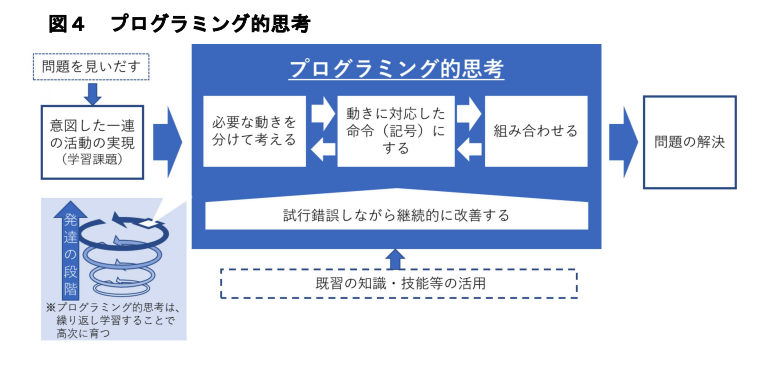
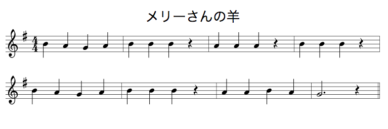

# メリーさんの羊を用いたプログラミング思考

## 概要

メリーさんの羊の演奏をプログラミング的思考で試行錯誤する学習・体験で音楽的表現のクリエイティビティは少なめ。micro:bit は使わずアンプラグド・プログラミングで試行錯誤を体験する。この体験の後に micro:bit を使用するとなお良い。

## 参考資料

* [小学校プログラミング教育の手引（第一版）](http://www.mext.go.jp/a_menu/shotou/zyouhou/detail/1403162.htm)

## 目的

* プログラミング的思考（下の図4 手引きp13）で「必要な動きを分けて考える」「動きに対応した命令（記号）にする」「組み合わせる」を通じて試行錯誤する
* 音楽（楽譜）からパターンを見出し一定のルールのもとに組み合わせて音楽を演奏する
* 事前にプログラミングされた直列に実行される処理と、イベントで実行される処理を試行錯誤する

## 課題

リコーダー等の簡易な楽器を演奏できる状態で行う。

### 楽譜内のパターン

メリーさんのひつじの楽譜からパターンを見出す

1小節の形をパターンとして、どんなパターンになっているかを見つける。

* A シラソラ
* B シシシ
* C ラララ
* D ララシラ
* E ソ

という形から、この曲は A→B→C→B→A→B→D→E というパターンで構成されている。2小節の形をパターンとして捉えれば

* A シラソラシシシ
* B ラララ シシシ
* C ララシラソ

という形から、この曲は A→B→A→C というパターンで構成されている。

### 役割分担

何人かのグループに分け1小節、2小節毎に役割を決め演奏させ1曲を完成させる。

### プログラミング課題

ここで、1曲が最後まで演奏できるのは全員が同じ楽譜を共有しているからで、その前提を壊す。楽譜をハサミで切り自分が演奏する部分のみを持ち、「全員が曲の全体を知らない」という前提を共有し、そこから最後まで演奏するにはどんな命令と組み合わせにすれば良いのかを考えさせる。

ここで例えば次のような成約を与える。

* ひとりが演奏できるのは連続して2小節まで
* 声を出してはいけない
* 体は動かして良い（動きのパターンは少ないほうが良い）
* 演奏開始は何らかの出来事（イベント）を観測したときのみ可能
  * 曲の全体を知らないので当然自分が演奏する前の小節が何かを知らない
* ひとりだけいきなり演奏開始できる

### 5人の場合

先程のA,B,C,D,Eのパターンで考える。例えば（うまくいかないが）、次のようなルールを最初に考えるかもしれない。あるいは、最初に冒頭4小節分のルールを与えても良い（間違いを含んだ状態で）。

* Aのルール
  * 演奏はシラソラのみ
  * いきなり演奏開始できる
  * 演奏が終わったらしゃがんで立つ（左手上げるでも何でも良い）
* Bのルール
  * 演奏はシシシのみ
  * AまたはCがしゃがんだら演奏する
  * 演奏が終わったらしゃがんで立つ
* Cのルール
  * 演奏はラララのみ
  * Bがしゃがんだら演奏する ★
  * 演奏が終わったらしゃがんで立つ
* Dのルール
  * 演奏はララシラのみ
  * Bがしゃがんだら演奏する ★
  * 演奏が終わったらしゃがんで立つ
* Eのルール
  * 演奏はソのみ
  * Dがしゃがんだら演奏する

このルールではC,DがBの演奏終了を見て同時に演奏開始するので4小節目で破綻する（ルールの競合）。また、5小節目のAが演奏開始できないので（ルールの漏れ）最後まで演奏できない。これを試行錯誤して解決させる。

### 解決例

問題が「Bは3回演奏するがBの演奏完了が何回目か観測者にはわからない（楽譜の全体を知らないので）」に気づくことが重要。Aも複数回（2回）演奏するがその後に演奏するのが常にBなので問題にならない。これを解決するために例えば

* Bの完了時の動作を三種類設定する
  * 1回目は右足上げる
  * 2回目は左足上げる
  * 3回目はしゃがんで立つ

という方法で実現できる。ただ動きのパターンを減らす工夫が可能。例えば「右方向に90度ずつ回転」とすれば、A,C,Dの演奏開始のルールをそれぞれ以下のようにし

* A：Bが後ろを向いたら演奏する
* C：Bが右を向いたら演奏する
* D：Bが左を向いたら演奏する

最後まで演奏することが可能になる。

